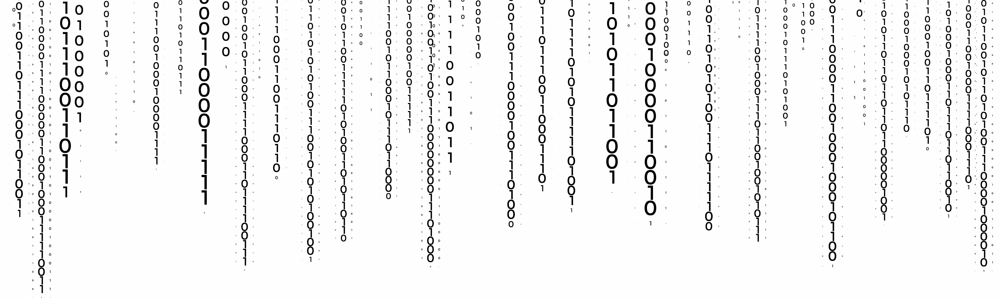

<h2 align="center">¡Hola!👋 Soy Christian</h2>

Apasionado por las nuevas tecnologías y los desafíos creativos.
  

Futuro programador y desarrollador estudiando <b>Desarrollo de Aplicaciones Web</b> en el centro <i>IES Luis Vives</i> en Leganés, Madrid (España). 

***

🌱Actualmente estoy aprendiendo **_HTML_** y **_Kotlin_**, este último un lenguaje de programación moderno, conciso y seguro que se puede utilizar tanto para el backend como para el frontend de las aplicaciones web. También estoy conociendo Git, un sistema de control de versiones distribuido que me permite gestionar el código fuente de mis proyectos de forma eficiente y colaborativa.

En este perfil podrás encontrar algunos de los proyectos que he realizado o en los que estoy trabajando, tanto en Kotlin como en otros lenguajes y frameworks.

Espero que te guste mi trabajo y que podamos colaborar(📫) en algún proyecto interesante. 

<b>¡Gracias por visitar mi perfil!</b>

> ### Mis lenguajes y herramientas:
> 

# 

...En construcción 👷

